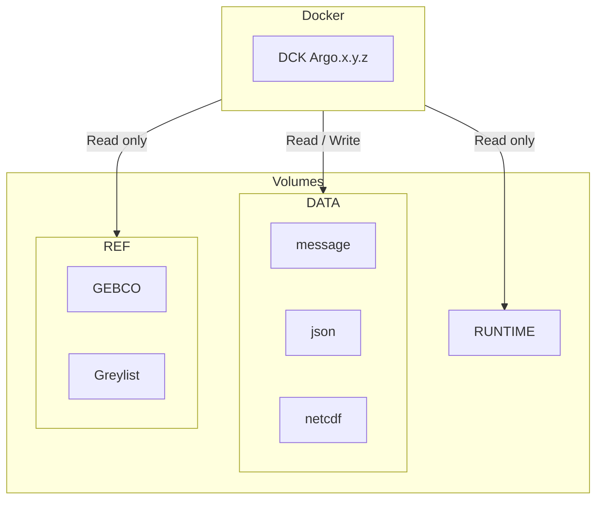

# Coriolis-data-processing-chain-for-Argo-floats

Coriolis data processing chain for Argo floats

The Coriolis Argo floats data processing chain decodes, processes, formats and performs quality control on floats data.
This repository contains the successive versions and intermediate patches of the decoder and configuration files.  
The major versions are also available from:

- <https://doi.org/10.17882/45589>

## Docker usage

## Architecture diagram



**Flux** :

<https://data-argo.ifremer.fr/ar_greylist.txt>

**Volumes** :

- `/mnt/runtime` : Matlab runtime environment
- `/mnt/data/output` : Output files directory
- `/mnt/data/rsync` : Input files directory
- `/mnt/data/config` :  external configurations directory
- `/mnt/ref/gebco.nc` : GEBCO file

## Run demo with docker compose

1. Clone repository

      ```bash
      git clone https://github.com/euroargodev/Coriolis-data-processing-chain-for-Argo-floats.git
      cd Coriolis-data-processing-chain-for-Argo-floats
      ```

2. Create environment variables file from `.env.docs` to configure your environment

      ```bash
      cp .env.docs .env
      ```

3. Configure your environement by editing `.env`

4. Run your decoder with docker compose

      ```bash
      docker compose up
      ```

## Run decoder in your environment

- Define next variables to configure your environment

```bash
DECODER_IMAGE=<decoder image path>
DECODER_IMAGE_TAG=<decoder image tag>

DECODER_RUNTIME_DIR=<path to runtime directory>
DECODER_DATA_INPUT=<path to input directory>
DECODER_DATA_CONF=<path to conf directory>
DECODER_DATA_OUTPUT=<path to output directory>
DECODER_REF_GEBCO=<path to gebco file>

USER_ID=<uid volumes owner>
GROUP_ID=<gid volumes owner>
```

- Run the following script as an example to decode the float `6904101`.

```bash
rm -rf $DATA_OUTPUT/iridium/*6904101 
rm -rf $DATA_OUTPUT/nc/6904101

docker run -it --rm \
--name "argo-decoder-container" \
--user $USER_ID:$GROUP_ID \
--group-add gbatch \
-v $DECODER_RUNTIME_DIR:/mnt/runtime:ro \
-v $DECODER_DATA_INPUT:/mnt/data/rsync:rw \
-v $DECODER_DATA_CONF:/mnt/data/config:ro \
-v $DECODER_DATA_OUTPUT:/mnt/data/output:rw \
-v $DECODER_REF_GEBCO:/mnt/ref/gebco.nc:ro \
$DECODER_IMAGE:$DECODER_IMAGE_TAG /mnt/runtime 'rsynclog' 'all' 'configfile' '/app/config/_argo_decoder_conf_ir_sbd.json' 'configfile' '/app/config/_argo_decoder_conf_ir_sbd_rem.json' 'xmlreport' 'co041404_20240124T112515Z_458271.xml' 'floatwmo' '6904101' 'PROCESS_REMAINING_BUFFERS' '1'
```
