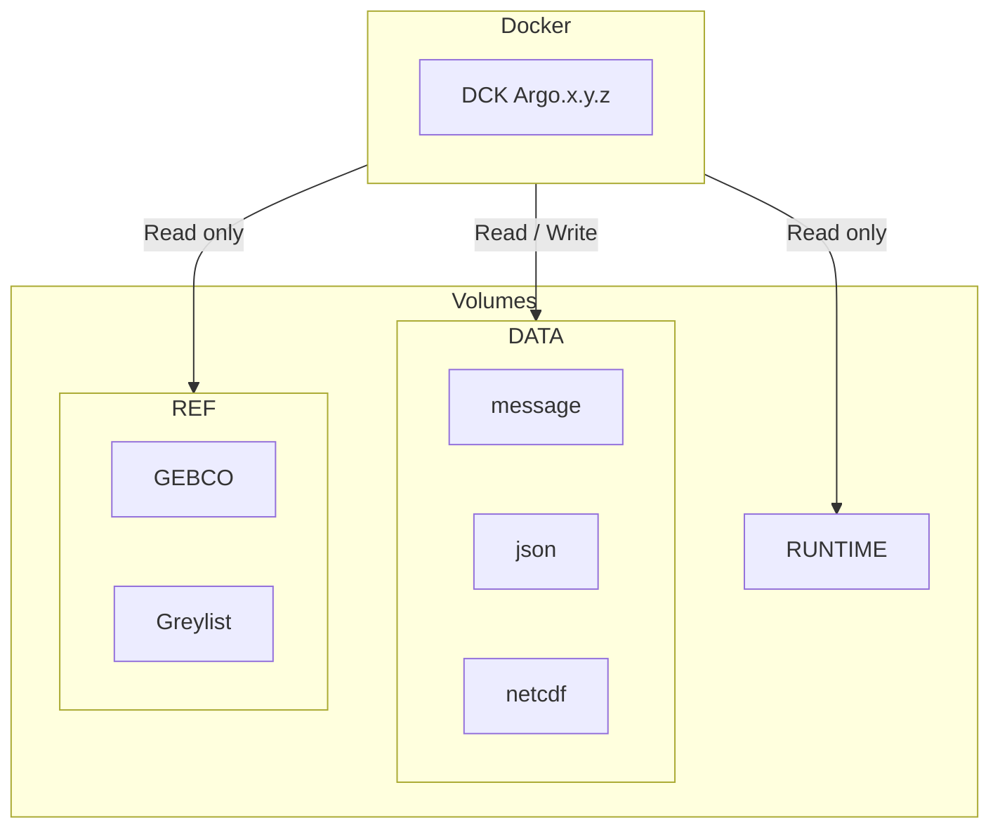

# Coriolis-data-processing-chain-for-Argo-floats

Coriolis data processing chain for Argo floats

The Coriolis Argo floats data processing chain decodes, processes, formats and performs quality control on floats data.
This repository contains the successive versions and intermediate patches of the decoder and configuration files.  
The major versions are also available from:

- <https://doi.org/10.17882/45589>

## Docker usage

## Architecture diagram



**Flux** :

<https://data-argo.ifremer.fr/ar_greylist.txt>

**Volumes** :

- `/mnt/runtime` : Matlab runtime environment
- `/mnt/data/output` : Output files directory
- `/mnt/data/rsync` : Rsync file directory
- `/mnt/data/config` :  external configurations directory
- `/mnt/ref/gebco.nc` : GEBCO file

## Run decode as a Docker container

- Setup environment variable to run decoder in your environment :

```bash
RUNTIME=/path-to-runtime # path to Matlab runtime environment
DATA_OUTPUT=/path-to-data-output # path for output data
DATA_RSYNC=/path-to-rsync # path for rsync
DATA_CONF=/path-to-configurations # path for external configurations
REF_GEBCO=/path-to-gebco/GEBCO_2021.nc # path to gebco file
APP_USER="<your_user_id>:<your_group_id>" # userid and groupid of owner of previous directories (watch out for the rights) 
APP_VERSION=REPLACE_BY_APP_VERSION # decoder version 
```

- Run the following script as an example to decode the float `6904101`.

```bash
rm -rf $DATA_OUTPUT/iridium/*6904101 
rm -rf $DATA_OUTPUT/nc/6904101

docker run -it --rm \
--name "argo-decoder-container" \
--user $APP_USER \
--group-add gbatch \
-v $RUNTIME:/mnt/runtime:ro \
-v $DATA_OUTPUT:/mnt/data/output:rw \
-v $DATA_RSYNC:/mnt/data/rsync:rw \
-v $DATA_CONF:/mnt/data/config:ro \
-v $REF_GEBCO:/mnt/ref/gebco.nc:ro \
ghcr.io/euroargodev/coriolis-data-processing-chain-for-argo-floats:$APP_VERSION /mnt/runtime 'rsynclog' 'all' 'configfile' '/app/config/_argo_decoder_conf_ir_sbd.json' 'configfile' '/app/config/_argo_decoder_conf_ir_sbd_rem.json' 'xmlreport' 'co041404_20240124T112515Z_458271.xml' 'floatwmo' '6904101' 'PROCESS_REMAINING_BUFFERS' '1'
```
